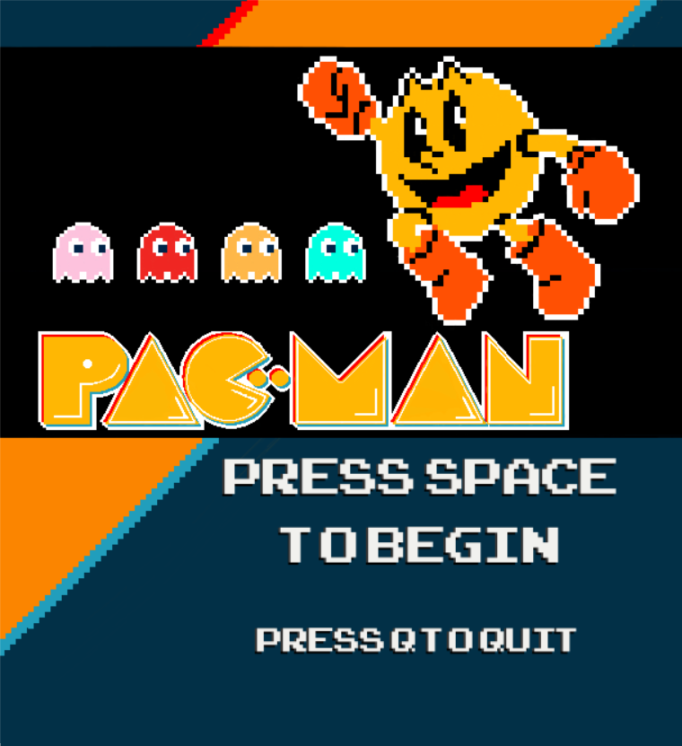
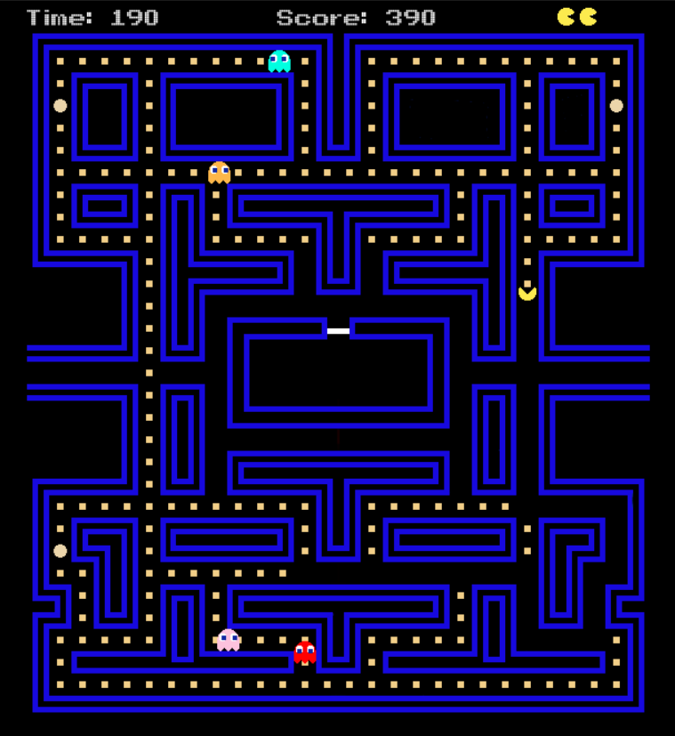

Welcome to my Pac-Man remake! Thank you for checking out my game. To run the game, ensure you have Python and Pygame installed on your system. Here are some key features:

Controls: Use the arrow keys to move Pac-Man and the space bar to pause the game.

Xbox Controller Support: This game is compatible with Xbox controllers. Press 'Start' for space, use the keypad for arrow keys, and 'B' to exit any prompts.

User Prompts: For any other functions, the game will provide prompts for your convenience.

Enjoy the classic Pac-Man experience!

