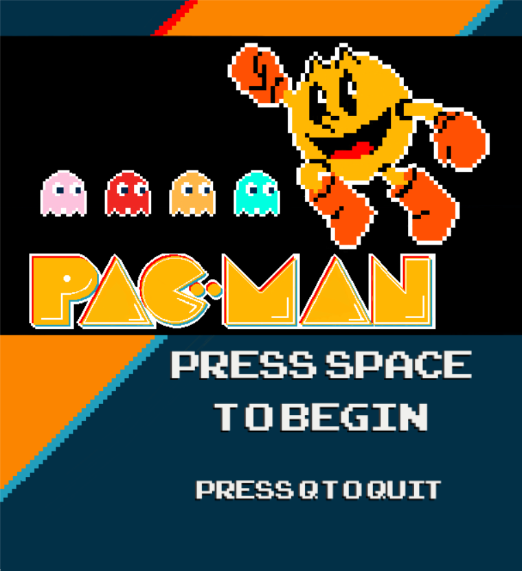
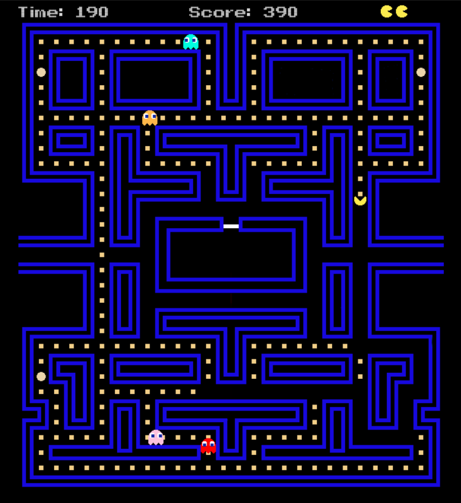
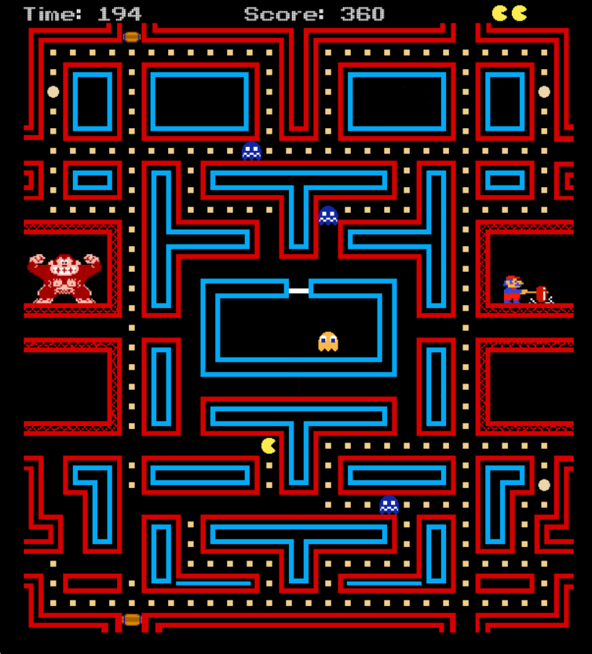

# Pac-Man
Recreation of the classic arcade game Pac-Man in python using the pygame library. 
To play the game you must first open main and hit run.
All other files should be ignored and not edited.

Controls: 
To control Pac-Man you must use the arrow keys 
and to pause you must press the spacebar at any time during gameplay. 
There will be a prompt for any other function.  

Thank you for checking out my game!

  
